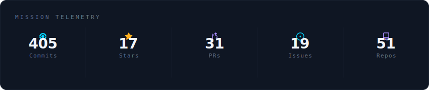

###

<h3 align="left">About Me</h3>

###

- 🌎 São Paulo, Brasil - 👨🏻‍💻 Coding since 2017 - 🎯 Learning English - 🎮 Game Dev on weekends - ✨ My Life: ✝️👨‍👩‍👧‍👦🏋🏻🥊🎼🎮📚

###

<h2 align="left"></h2>

<h3 align="left">Details</h3>

###

  

 

  

 

  

 

  

###

<h2 align="left"></h2>

<h3 align="left">Stats Graph</h3>

###

###

<h2 align="left"></h2>
<h3 align="left">Social</h3>

###

  
  

###
